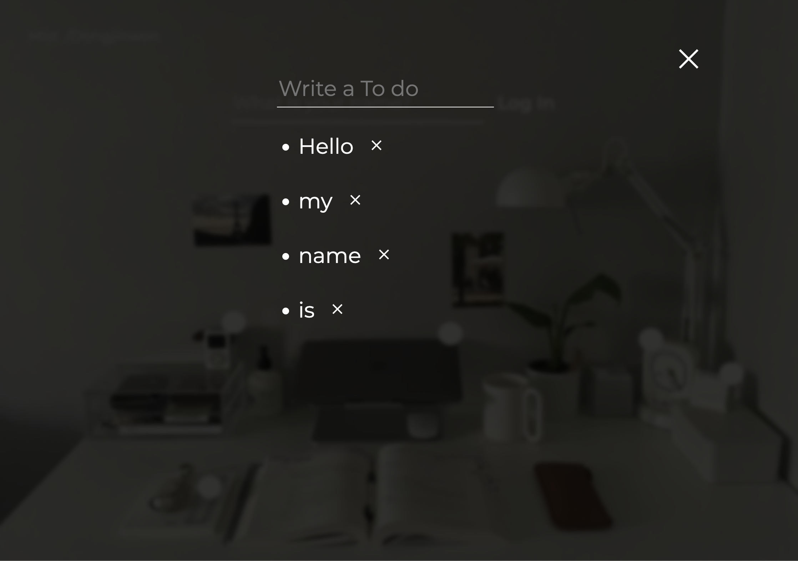
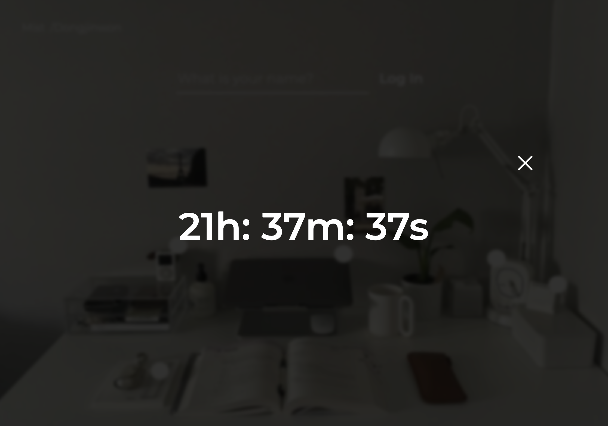
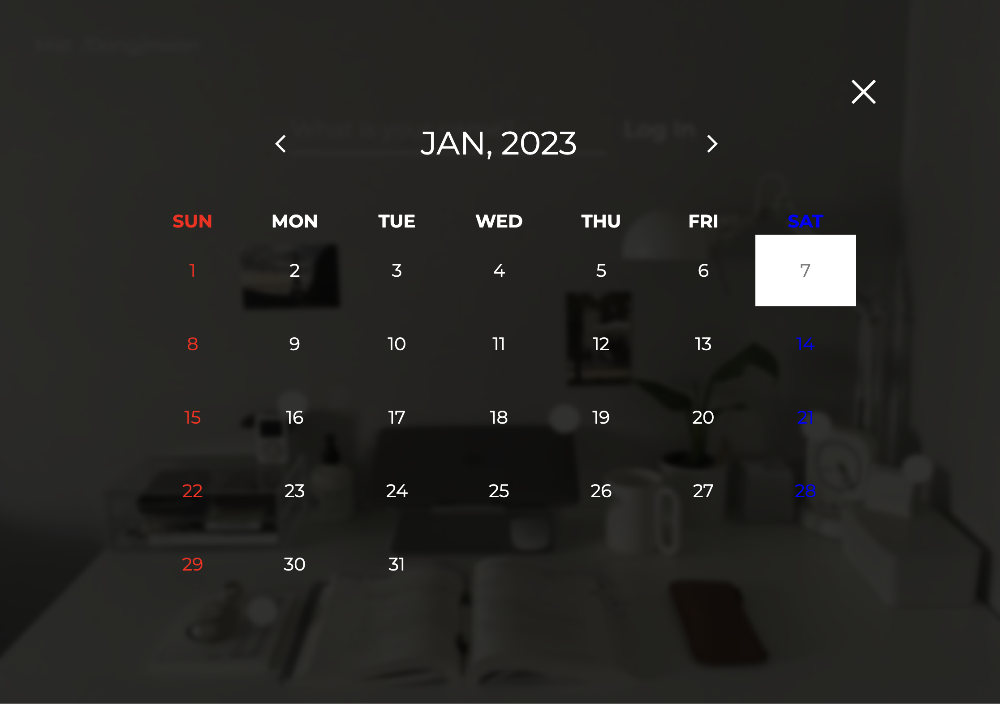
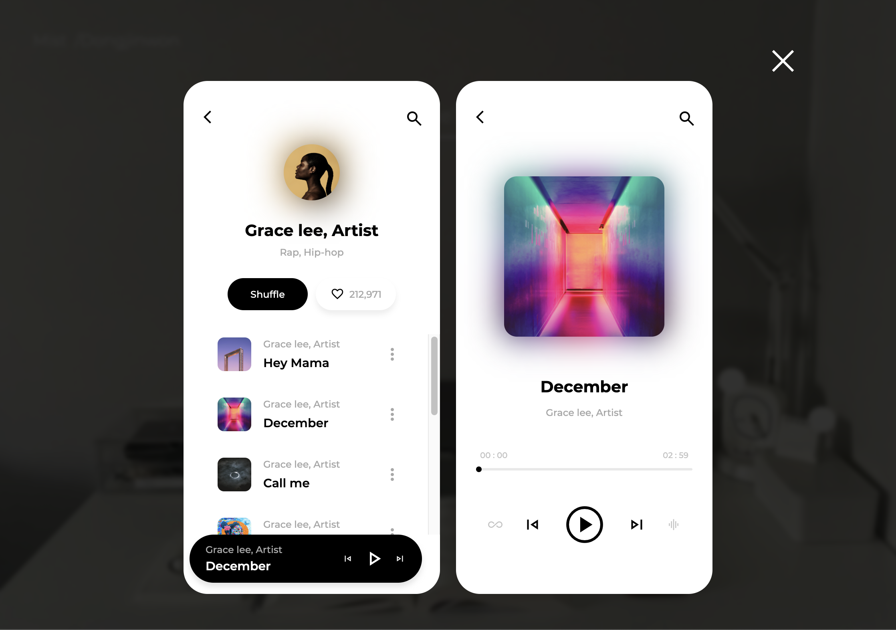

# Room tour  
### html, css, javascript로 만든 프로젝트입니다.  
평소에 방 인테리어에 관심이 많아서 떠오르는 아이디로 만든 프로젝트입니다.  
각 이미지에 맞게 클릭을 하면 그에 맞는 기능들을 구현하였습니다.  

   
  
  
  
  
  
   

## 구현 기능

<li>Math 메서드를 활용하여 랜덤 백그라운드 이미지 구현 </li> 

<li>Date 메서드를 활용하여 달력, 시계 기능 구현 </li> 

<li>iframe 태그를 활용하여 src에 맞는 화면 구현 </li> 

<li>Audio 태그를 활용하여 뮤직플레이어 기능 구현 </li> 

<li>localStorage에 저장되는 to-do-list 구현 </li> 

<li>실시간 날씨와 사용자 위치정보를 알 수 있는 기능 구현</li> 
 

 

## 기술 스택

|    html    |     css    |     javascript   |      figma    |
| :--------: | :--------: | :--------:   |    :--------:   |   
|  ![html]   |   ![css]   |   ![js]  |  ![figma]   |   

 

## 배운 점

<li>Math.random()를 이용하여 배열 안의 데이터를 랜덤으로 갖고 와 background에 gradient효과를 주었습니다.</li> 
<li>Date메서드를 이용해 hours, minutes, second를 가지고 온 다음 setInterval함수를 이용해 화면에 구현하였습니다.</li> 
<li>document.createElement를 이용해 list를 생성하고 localStorage에 저장해 나갔다가 다시 들어가도 다시 볼수 있는 To-do-list를 구현하였습니다.</li> 
<li>오픈소스인 날씨와 위치 API에 데이터들을 fetch메서드를 이용해 가져와 화면에 구현하였습니다.</li> 
<li>Audio태그를 이용하여 각 종 내장 메서드를 활용해 뮤직플레이어를 구현하였습니다.</li> 

 

<!-- Stack Icon Refernces -->
[html]: /image/stack/html.svg
[css]: /image/stack/css.svg
[figma]: /image/stack/figma.svg
[ts]: /image/stack/typescript.svg
[js]: /image/stack/javascript.svg
[react]: /image/stack/react.svg
[node]: /image/stack/node.svg
